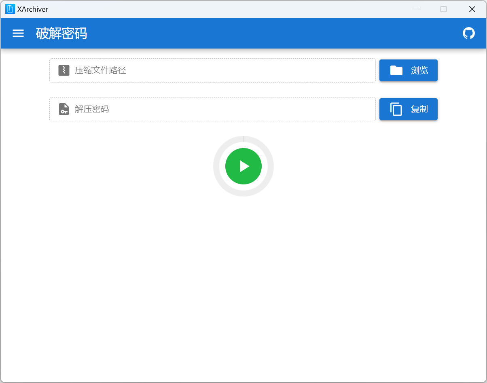
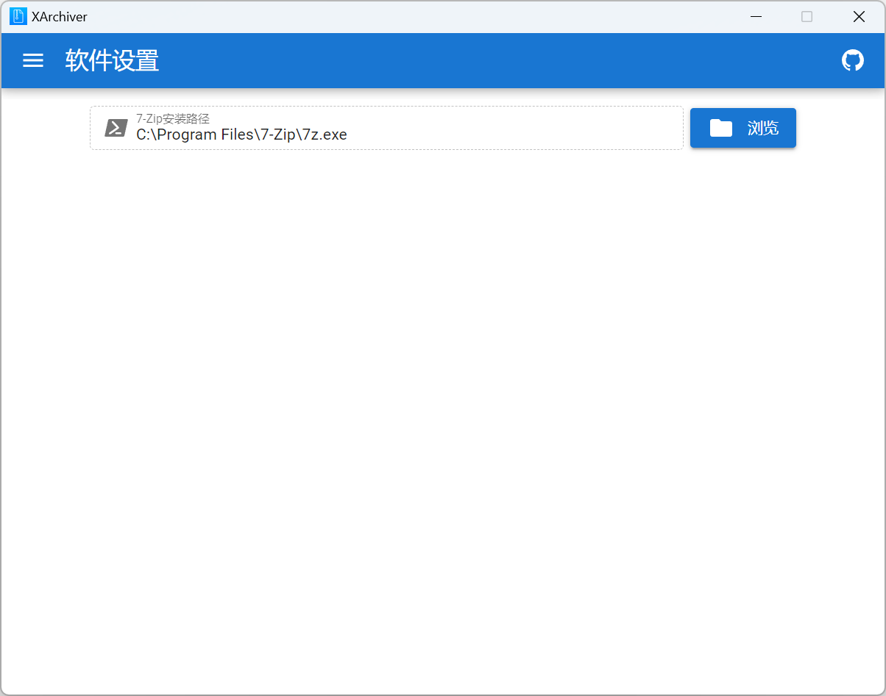

<p align="center">
  
</p>

<h2 align="center"> XArchiver </h2>

<p align="center">
  网上下载的压缩包资源找不到解压密码？欢迎使用 XArchiver 碰碰运气~
</p>

<p align="center">
  <a href="https://github.com/vscodev/XArchiver/actions">
    
  </a>
  <a href="https://github.com/vscodev/XArchiver/releases">
    
  </a>
  <a href="https://xarchiver.voicehub.top">
    
  </a>
</p>

## 概述

一般来说，压缩包密码是不可能被破解的。以 [Unicode® 13.0.0](https://www.unicode.org/versions/Unicode13.0.0/) 为例，官方公布的字符数有143859个，假设解压密码最多3个字符，可能性就超过 $143859^{3} > 2.97 \times 10^{15}$ 种，每秒处理1亿个密码也需要近1年的时间。因此，如果你的电脑没有比肩超级计算机的算力，任何所谓的破解都是徒劳的！

然而在很多情况下，某个网站分享资源使用的解压密码是既定的，比如 `www.example.com`  通常以 `example` 或者 `example.com` 作为默认的解压密码。实践表明，发掘和收集这些资源分享站常用的解压密码，通过高质量的密码字典来破解那些你找不到出处的加密压缩包资源是可能的，XArchiver 因此诞生。

XArchiver 是一款基于大数据的压缩包密码破解软件，它并不穷举所有可能性，而仅遍历那些在网上被经常使用的解压密码，在大幅提升破解效率的同时成功率也远高于传统的暴力破解方式。

## 下载安装

你可以从 [Release](https://github.com/vscodev/XArchiver/releases) 下载 XArchiver 的最新版本，支持Windows_x64、Linux x86_64以及macOS 11+。



对于macOS，你需要允许打开来自身份不明开发者的App。

```sh
sudo xattr -r -d com.apple.quarantine /Applications/XArchiver.app
```

XArchiver 需要你安装 [7-Zip](https://www.7-zip.org/download.html) 并在「软件设置」中正确配置7-Zip的安装路径才能正常工作，如下图所示：



## 订阅授权

你可通过 [爱发电](https://afdian.net/a/vscodev) 平台订阅 XArchiver ，支付成功后激活码会自动通过爱发电私信发送给你。老用户请登录后前往 [我的帐号](https://xarchiver.voicehub.top/account) 页面激活授权，新用户使用激活码成功 [注册帐号](https://xarchiver.voicehub.top/auth/register) 后会自动激活。

:warning:订阅仅为你解锁软件的使用权，尽管历史数据显示 XArchiver 拥有不俗的破解成功率，但仍无法保证一定能为你找到解压密码。

## 注意事项

XArchiver 帐号仅限本人使用，不得分享、外借或转让。如果你滥用本站提供的服务，包括但不限于伪造压缩包测试软件的功能、模拟客户端的网络请求试图攻击服务器，系统有权在不通知的情况下封设备、封IP、封帐号！
